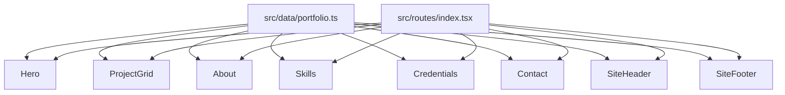

# GABRIEL e-PORTFOLIO

Public portfolio for **Gabriel Atta**, HSE Engineer in Dubai. One editorial page: selected site work, a short biography, capabilities, credentials, and a contact note. Built as a record of the work, not a brochure.

Open to HSE leadership roles.

| | |
|---|---|
| Role | HSE Engineer |
| Location | Dubai, UAE |
| Email | [gatta9707@gmail.com](mailto:gatta9707@gmail.com) |
| Phone | [+971 54 319 1697](tel:+971543191697) |
| CV | [`public/gabriel-atta-cv.pdf`](public/gabriel-atta-cv.pdf) |
| Repository | [kwesi0568-alt/GABRIEL-e-PORTFOLIO](https://github.com/kwesi0568-alt/GABRIEL-e-PORTFOLIO) |

## Contents

- [What the page does](#what-the-page-does)
- [Selected work](#selected-work)
- [Capabilities](#capabilities)
- [Credentials](#credentials)
- [Contact form](#contact-form)
- [Design](#design)
- [Stack](#stack)
- [Requirements](#requirements)
- [Run locally](#run-locally)
- [Scripts](#scripts)
- [Project layout](#project-layout)
- [How the page is built](#how-the-page-is-built)
- [Editing the site](#editing-the-site)
- [Accessibility and motion](#accessibility-and-motion)
- [Environment](#environment)
- [Deploy](#deploy)
- [License](#license)

## What the page does

The site is a single route (`/`) with smooth in-page navigation. The header stays fixed. On small screens a menu button opens a full-screen list of the same links and locks background scroll until it closes.

| Section | Anchor | What it shows |
|---|---|---|
| Hero | `#top` | Name set in a large serif, role, Dubai, and the practice line: ISO 45001, permit-to-work, and RAMS for workforces above 400. A “Selected work” link scrolls to the grid. |
| Selected work | `#work` | Six project cards. Filter chips: All, Governance, High-rise, Digital, Systems. The first visible card spans the full width. On desktop, hover or keyboard focus reveals a short description and a “Talk about this work” link into the contact section. On small screens the description is always visible under the title. |
| About | `#about` | Portrait, biography, and four figures: zero lost-time injuries (24+ months), 98% third-party audit compliance, 40% fewer repeat incidents after root-cause analysis, and a 400+ peak workforce. CV download. |
| Capabilities | `#skills` | Eight numbered disciplines, set as an editorial index. |
| Credentials | `#credentials` | NEBOSH IGC, OSHA 30-Hour, Khalifa University HSE Engineering, UC Davis process safety, and the Google Project Management Certificate. Psychology degree in progress (expected 2029). |
| A note | `#contact` | Email, phone, location, availability, and a form. |
| Footer | — | A second index of the same sections, the four practice areas, studio links including the CV, and a colophon. |

Section ids match the `NAV` list in [`src/data/portfolio.ts`](src/data/portfolio.ts). Each section uses `scroll-mt-20` so the fixed header does not cover the title.

## Selected work

Content lives in `PROJECTS` inside [`src/data/portfolio.ts`](src/data/portfolio.ts). Photographs are in [`public/images/`](public/images/).

| Project | Category | Years | Role | Image |
|---|---|---|---|---|
| Steel & Facade Programme | Governance | 2025 | HSE Officer, German Steel Contracting | `public/images/steel.jpg` |
| Digital Safety Stack | Digital | 2025 | HSE Officer, German Steel Contracting | `public/images/digital.jpg` |
| High-rise Residential | High-rise | 2022–25 | Safety Officer, Evan Lim Penta | `public/images/highrise.jpg` |
| High-risk RAMS | High-rise | 2022–25 | Safety Officer, Evan Lim Penta | `public/images/excavation.jpg` |
| Permit-to-Work | Systems | 2025 | HSE Officer, German Steel Contracting | `public/images/ptw.jpg` |
| Lifting & Cranes | Systems | 2022–25 | Safety Officer, Evan Lim Penta | `public/images/crane.jpg` |

Filters are client-side. Choosing a chip hides the other categories and announces the new count to assistive technology. “All” restores the six cards, with Steel & Facade as the featured wide card.

The steel and facade programme covers seven concurrent German Steel projects, valued over AED 100 million, with a workforce above 400. The high-rise cards are the Evan Lim Penta years: main-contractor HSE from substructure to superstructure, plus RAMS for deep excavations, tower-crane lifts, formwork, post-tensioning, and heavy pours.

## Capabilities

| | Discipline | What it covers on this site |
|---|---|---|
| 01 | HSE Governance | ISO 45001, UAE federal rules, client specifications |
| 02 | Risk Assessment | Task-specific RAMS, then checked in the field |
| 03 | Hazard Identification | Inspections and tracked close-out |
| 04 | Construction Safety | High-rise, structural steel, and facade, from substructure to topping-out |
| 05 | Incident Investigation | Root-cause analysis tied to the 40% drop in repeat incidents |
| 06 | Emergency Preparedness | Drills, muster, and Civil Defense alignment |
| 07 | Permit-to-Work | Authorisation, isolation, and close-out across subcontractors |
| 08 | Safety Systems | Documentation and digital reporting that held a 98% third-party audit |

## Credentials

| Credential | Issuer | Year |
|---|---|---|
| NEBOSH International General Certificate | NEBOSH IGC, Occupational Health and Safety | 2024 |
| OSHA 30-Hour General Industry | IASP | 2025 |
| HSE Engineering Specialisation | Khalifa University, on Coursera | 2025 |
| Chemical Hazards and Process Safety | University of California, Davis | 2025 |
| Google Project Management Certificate | Google, on Coursera | 2025 |

Education in progress: Bachelor of Science in Psychology, O.P. Jindal Global University, expected 2029.

## Contact form

The form does not send email and has no server. It checks the fields in the browser, then stores the note in `localStorage` under the key `atta-notes`.

Each stored note is a JSON object:

```json
{
  "name": "Ada Mensah",
  "email": "ada@example.com",
  "intent": "role",
  "message": "We are hiring an HSE lead for a facade package in Dubai.",
  "at": "2026-10-02T18:00:00.000Z"
}
```

Validation:

- Name must be at least 2 characters.
- Email must contain a local part, an `@`, and a domain with a dot.
- Message must be at least 16 characters.
- Intent is one of `role` (“A role”), `project` (“A project”), or `hello` (“A hello”). The default is `role`.

Errors sit under the field and are tied to it with `aria-describedby`. A successful submit replaces the form with a thank-you state and the sender’s name. “Send another” clears the fields. Private-mode browsers that block `localStorage` still show the thank-you state; the note is not kept.

Use the email and phone links for a message that should actually arrive. Those `mailto:` and `tel:` links are also in the footer.

## Design

The page is an editorial layout: generous margins, a serif display face, sharp corners, and almost no decoration.

Tokens are CSS variables in [`src/styles.css`](src/styles.css), consumed as Tailwind utilities (`bg-bg`, `text-fg`, `font-serif`, `px-gutter`, `py-section`, `text-display`).

| Token | Value | Use |
|---|---|---|
| `--color-bg` | `#F3EEE6` | Page, warm paper |
| `--color-fg` | `#171411` | Ink, also the footer background |
| `--color-muted` | `#6B6459` | Kickers, secondary lines |
| `--color-primary` | `#2A5C50` | Forest teal: selection, form errors, primary buttons |
| `--color-surface` | `#E7DFD2` | Image wells, success panel |
| `--color-border` | `#D4CBB8` | Rules and chip outlines |
| `--font-serif` | Fraunces | Name, section titles, project titles |
| `--font-sans` | Figtree | Body, navigation, form |
| `--text-display` | `clamp(4.25rem, 14vw, 10.5rem)` | Hero name |
| `--spacing-gutter` | `clamp(1.25rem, 4vw, 3.5rem)` | Page inset |
| `--spacing-section` | `clamp(4.5rem, 10vw, 8.5rem)` | Vertical rhythm |

Fraunces and Figtree load from Google Fonts in the document head. If the fonts fail, the page falls back to Times New Roman and the system sans.

Share-card identity is [`src/lib/og/site.json`](src/lib/og/site.json) (`title`: Gabriel Atta, `card`: custom) plus [`public/og.jpg`](public/og.jpg) at 1200×630 and [`public/favicon.svg`](public/favicon.svg).

## Stack

- [TanStack Start](https://tanstack.com/start) `~1.168.60` and TanStack Router, on React 19
- Vite 8 and TypeScript
- Tailwind CSS v4
- Radix Slot, `class-variance-authority`, and `lucide-react` for the button, menu icon, and arrows
- Nitro, targeting a Vercel build (`.vercel/output`)

`@tanstack/react-start` stays on the patched 1.168 line (1.168.60 or newer). Earlier 1.168 releases are affected by [CVE-2026-102989](https://tanstack.com/blog/tanstack-start-security-update-cve-2026-102989). The resolved `@tanstack/start-server-core` in this lockfile is 1.169.39.

Auth and the database helpers are in the tree because the app framework ships them. This portfolio does not turn them on. There is no sign-in page, and the contact note never leaves the browser.

## Requirements

- Node.js 22
- npm

No database, no API key, and no `.env` file are required to run or build the page.

## Run locally

```bash
git clone https://github.com/kwesi0568-alt/GABRIEL-e-PORTFOLIO.git
cd GABRIEL-e-PORTFOLIO
npm install
npm run dev
```

The dev server listens on [http://127.0.0.1:8080](http://127.0.0.1:8080) and on all interfaces (`0.0.0.0:8080`). `npm run dev` starts Vite through `scripts/with-app-env.mjs` so the app env flag is present. Do not start `vite` by itself.

Production build, then a local preview of that build:

```bash
npm run build
npm run preview
```

`npm run build` also runs `npm run db:migrate`. With no `DATABASE_URL` set, the migration step prints that it is skipping and exits successfully. That is expected.

## Scripts

| Script | Purpose |
|---|---|
| `npm run dev` | Dev server on port 8080 |
| `npm run build` | Production client, SSR, and Nitro output, then the migration script |
| `npm run build:dev` | Vite build in development mode |
| `npm run preview` | Serve the production build |
| `npm run preview:restart` | Stop and start the preview server |
| `npm run preview:stop` | Stop the preview server |
| `npm run db:migrate` | Apply SQL migrations when `DATABASE_URL` is set; otherwise skip |
| `npm run typecheck` | `tsc --noEmit` |
| `npm run lint` | ESLint |
| `npm run format` | Prettier write |
| `npm run check:auth` | Auth-wiring invariant used by the framework scaffold |
| `npm test` | Node tests for scripts plus a small set of library tests |

## Project layout

```
src/
  routes/__root.tsx       Document shell, fonts, favicon, meta description
  routes/index.tsx        The one page: header, sections, footer
  router.tsx              TanStack router factory
  styles.css              Tailwind v4 theme and base rules
  data/portfolio.ts       Name, contact, projects, skills, credentials, stats, nav
  components/             Header, hero, work grid, about, skills, credentials, contact, footer
  components/ui/          Button, input, label, textarea
  lib/og/site.json        Share-card title
  lib/utils.ts            cn() class helper
public/
  images/                 Project photographs and portrait.jpg
  gabriel-atta-cv.pdf     Downloadable CV
  og.jpg                  1200×630 share card
  favicon.svg
```

Routes are file-based. `src/routeTree.gen.ts` is generated by the TanStack router plugin the first time you run the dev server or a build. Commit the generated file if it changes after you add a route. This site only needs `/`.

## How the page is built



`ProjectGrid` keeps the active filter in React state. `ContactSection` keeps the form in React state and writes one record to `localStorage` on a valid submit. Nothing else on the page fetches data.

## Editing the site

Almost all copy is data, not markup.

1. Open [`src/data/portfolio.ts`](src/data/portfolio.ts).
2. Change `SITE` for name, email, phone, location, availability, CV path, or the hero line. The email string is used for both the visible address and the `mailto:` link.
3. Add or edit an entry in `PROJECTS`. `category` must be `Governance`, `High-rise`, `Digital`, or `Systems`. `id` must be unique. Put the image in `public/images/` and point `image` at a root path such as `/images/steel.jpg`. Write a real `alt` string.
4. A new filter label is a new string in `CATEGORIES` plus that same string as a project `category`. The `All` chip is not a project category.
5. Edit `SKILLS`, `CREDENTIALS`, or `STATS` the same way. Skill `index` values are display labels (`"01"`), not array indexes.
6. Navigation labels are the `NAV` array. Each `href` must match a section `id` (`#work`, `#about`, `#skills`, `#credentials`, `#contact`).

Replace the portrait at `public/images/portrait.jpg` and the CV at `public/gabriel-atta-cv.pdf` without renaming them, or update `SITE.cvHref` and the about section if you do.

Buttons, fields, and the textarea take their look from `src/components/ui`. Change those files if you want a different control style. Change `src/styles.css` if you want a different palette or type scale. Do not hard-code a new hex color in a component; add a token and use the utility.

## Accessibility and motion

- Filter chips are tabs (`role="tab"`, `aria-selected`) inside a `tablist`.
- The mobile menu button exposes `aria-expanded` and an accessible name that switches between “Open menu” and “Close menu”.
- Form errors use `aria-invalid` and `aria-describedby`.
- The filter result count is in a visually hidden live region.
- Focus rings are a 2px ink outline with a 3px offset.
- `html` uses `scroll-behavior: smooth`. Both that and the hover zoom are turned off under `prefers-reduced-motion: reduce`.
- Hover captions are `max-md:hidden`. Below the `md` breakpoint the summary is in the normal document flow, so nothing depends on hover.
- Tap targets on chips, the menu button, and the submit button are at least 44px.

## Environment

| Variable | Required | What it does here |
|---|---|---|
| `DATABASE_URL` | No | If unset, `npm run db:migrate` skips. The page does not query a database. |
| `VITE_AUTH_ENABLED` | No | Injected by `scripts/with-app-env.mjs` for the framework scaffold. This page has no accounts. |

Do not commit a `.env` file. Do not commit `node_modules`, `.vercel`, or local screenshots. Those paths are already in [`.gitignore`](.gitignore).

## Deploy

The production build targets Vercel. `vite build` writes `.vercel/output`. Connect this repository to a Vercel project and use:

| Setting | Value |
|---|---|
| Framework | Vite, or Other if the TanStack preset is not listed |
| Install command | `npm install` |
| Build command | `npm run build` |
| Node.js | 22 |

No environment variables are required for the portfolio itself. After a framework upgrade, confirm `node -p "require('@tanstack/react-start/package.json').version"` prints `1.168.60` or newer before you publish. Hosts that block [CVE-2026-102989](https://tanstack.com/blog/tanstack-start-security-update-cve-2026-102989) will refuse an older 1.168 build.

`public/` is copied as static files. The CV is therefore available at `/gabriel-atta-cv.pdf` on whatever host serves the build.

## License

No license is granted by default. Ask before reusing the copy, photographs, portrait, or CV.
